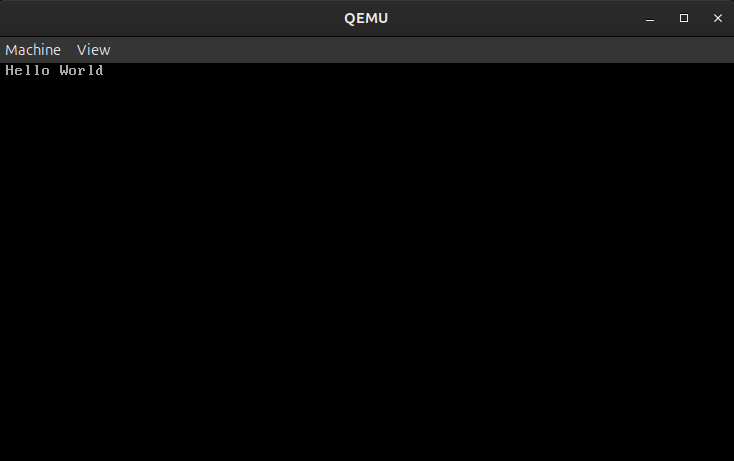

# Novium OS


Novium OS is a hobby x86 operating system built from scratch. The architecture is heavily inspired by Linux, but stripped down to the absolute basics. If you are into low-level engineering, feel free to open a PR or share ideas.


## About the project

I wanted to build a hobby OS that is clean, and easy to extend. The main idea is just to build it step by step without over-engineering the code.

## Current status

Right now, I'm focusing on getting the core x86 foundations solid:
- Stable x86 booting
- Basic console output
- Handling early hardware input
- Setting up memory management and interrupts
- Long-term: a lightweight desktop interface


## Project structure

The layout is inspired by the Linux kernel, but kept pretty simple:

- arch/ - low-level boot and architecture-specific code
- drivers/ - basic hardware support
- kernel/ - core kernel code such as scheduling and interrupts
- init/ - startup and kernel entry
- include/ - shared headers and interfaces
- mm/ - memory management
- fs/ - filesystem work
- ipc/ - inter-process communication
- lib/ - utility code
- Documentation/ - notes and planning files

## Boot flow

The current boot path is pretty straightforward:

```text
boot.S -> setup.S -> bootstrap.S -> hw_init.c -> init/main.c
```

For a detailed walkthrough of each stage, see [Documentation/boot_flow.md](Documentation/boot_flow.md).


## Build and Run

### System Dependencies

To compile and run Novium OS, you need a 32-bit capable compiler toolchain and the QEMU emulator

#### Linux (Ubuntu / Debian)

The primary development environment for Novium OS is Linux (Ubuntu/Debian) you can also use Windows with WSL.

```bash
sudo apt update && sudo apt install build-essential gcc-multilib qemu-system-x86 make bear 
```

#### Windows (via WSL2)

You can build Novium OS on Windows using the Windows Subsystem for Linux (WSL2) and a native Windows emulator.

1. Install WSL2 (Ubuntu) by running this in PowerShell as Administrator:
   ```powershell
   wsl --install
   ```

2. Download and install [QEMU for Windows](https://qemu.org) to its default path (`C:\Program Files\qemu`).

3. Open your WSL2 Ubuntu terminal and install the compiler tools:
   ```bash
   sudo apt update && sudo apt install build-essential gcc-multilib make bear
   ```

4. Link WSL2 to your Windows QEMU by running these lines in your WSL terminal:
   ```bash
   echo "alias qemu-system-i386='\"/mnt/c/Program Files/qemu/qemu-system-i386.exe\"'" >> ~/.bashrc
   echo "alias qemu-system-x86_64='\"/mnt/c/Program Files/qemu/qemu-system-x86_64.exe\"'" >> ~/.bashrc
   source ~/.bashrc
   ```

### Compile

Once your dependencies are installed (either on native Linux or inside WSL2), build the OS:

```bash
make clean
bear -- make
```

### Execution

launch the kernel directly through QEMU:

```bash
make run
```

or run the raw floppy disk image to include the bootloader:

```bash
make run-raw
```


## Roadmap

- [x] Boot chain and protected mode
- [x] Basic console output
- [ ] Interrupt handling (IDT, PIC, IRQs)
- [ ] Keyboard and timer drivers
- [ ] VBE / framebuffer graphics
- [ ] Memory management
- [ ] Basic scheduling
- [ ] Simple filesystem
- [ ] Boot from a hard drive
- [ ] Lightweight desktop interface

See [Documentation/todo.md](Documentation/todo.md) for the detailed task list.

## Notes

Directories like `mm/`, `ipc/`, `lib/`, `fs/`, `userspace/` and some files inside of `arch/` currently contain stubs and placeholder files because I still have to write some of the kernel before I can write those.
