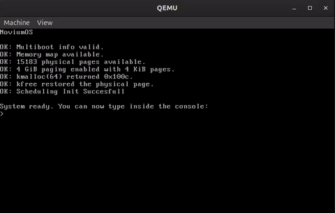

# Novium OS




Novium OS is a hobby x86 operating system built from scratch. The architecture is heavily inspired by Linux, but stripped down to the absolute basics. If you are into low-level engineering, feel free to open a PR or share ideas.

> [!NOTE]
> Directories like `mm/`, `ipc/` and `fs/` currently contain early stubs.


## Project structure

The layout is inspired by the Linux kernel, but kept pretty simple:

- arch/ - low-level boot and architecture-specific code
- drivers/ - basic hardware support
- kernel/ - core kernel code such as scheduling and interrupts
- init/ - startup and kernel entry
- include/ - shared headers and interfaces
- mm/ - memory management
- fs/ - filesystem work
- ipc/ - inter-process communication
- lib/ - utility code
- Documentation/ - notes and planning files

## Boot flow

Im going to switch to grub in my next commit so right now there still is a bootloader but im not going to explain cause im switching right now.


## What i've done so far

- [x] Boot chain and protected mode
- [x] Basic console output
- [x] Interrupt handling (IDT, PIC, IRQs)
- [x] Working QWERTY keyboard drivers
- [x] Added low-level boot headers
- [x] Printf
- [x] Cpu scheduler

See [CHANGELOG.md](CHANGELOG.md) for official release history
See [Documentation/todo.md](Documentation/todo.md) for the detailed task list and future plans.


## Build and Run

>[!NOTE]
> Were switching to just tags and no more iso releases cause its easier to just download dependencies and run on your own

### System Dependencies

Compiling Novium OS requires a 32-bit cross-compiler toolchain and the QEMU emulator.

#### **Linux (Ubuntu, Debian, Fedora, Mint, Arch):**

<br>

**Ubuntu / Debian / Mint:**
```bash
sudo apt update && sudo apt install -y build-essential gcc-multilib qemu-system-x86 grub-common grub-pc-bin xorriso mtools bear
```

**Fedora:**
```bash
sudo dnf install gcc make binutils gcc-c++ glibc-devel.i686 qemu-system-x86 grub2-tools grub2-tools-extra xorriso mtools bear -y
```

**Arch Linux:**
```bash
sudo pacman -Syu --needed base-devel lib32-gcc-libs qemu-desktop grub xorriso mtools bear
```
*(Arch users: Ensure `[multilib]` is enabled in your `/etc/pacman.conf` for 32-bit compilation libraries).*

#### Windows (via WSL2)

Build on Windows using WSL2 tied to a native Windows QEMU installation:

1. **Install WSL2 (Ubuntu)** in Administrator PowerShell:
   ```powershell
   wsl --install
   ```
<br>

2. Download and install [QEMU for Windows](https://qemu.org) to its default path (`C:\Program Files\qemu`).

<br>

3. **Install build tools** inside your WSL2 terminal:
   ```bash
   sudo apt update && sudo apt install -y build-essential gcc-multilib qemu-system-x86 grub-common grub-pc-bin xorriso mtools bear
   ```
<br>

4. **Link WSL2 to Windows QEMU** by running this in your WSL2 terminal:
   ```bash
   echo "alias qemu-system-i386='\"/mnt/c/Program Files/qemu/qemu-system-i386.exe\"'" >> ~/.bashrc
   source ~/.bashrc
   ```

### Compile

After the dependencies are installed build the OS:

```bash
make clean
bear -- make # or just make
```

### Execution

Now run the OS:

```bash
make run
```

